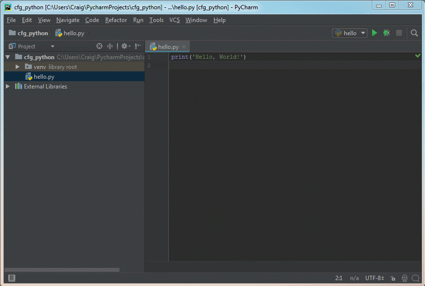
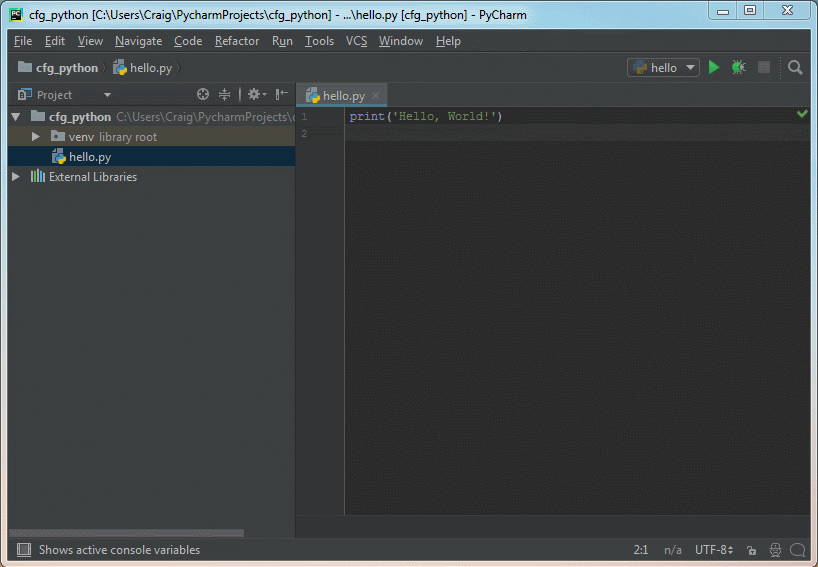

In pairs, discuss why you think programming is important

*5 mins*

---

# Code First: Girls

#### Python Session 1

---

Course overview:

1. Data types, variables and operations
1. Input, functions, loops and conditionals
1. Flask
1. APIs
1. Git and the command-line
1. Group project and Deploying code
1. Group project
1. Group presentations

---

Instructors 

---

This session
1. Run Python with files and shell
1. Data types
1. Maths operations
1. Variables
1. User input

---

Slides are available at [https://github.com/craigargh/cfg-python](https://github.com/craigargh/cfg-python)

---

Session preparation

----

PyCharm
- Go to [www.jetbrains.com/pycharm/download/](https://www.jetbrains.com/pycharm/download/)
- Download **Community** edition
- Install with default options

---

Python
1. Designed to be clean and readable
1. 3rd party libraries
 - Web
 - Data science
 - Machine learning
1. Popular

---

### Your first Python program

----

Create a new project


----

Create a new file


----

Add this to `hello.py`

``` python
print('Hello, World!')
```

Note: hello.py

----

Run the program:



---

### Numbers and Operators in Python

----

The Python shell

- Each line starts with `>>>`
- Interactive
- Immediate output
- Exploration
- Can't re-run (use files instead)

----



----

#### Task

Type these lines into your **Python shell** (don't type the `>>>`)

``` python
>>> 5 - 6
>>> 8 * 9
>>> 6 / 2
>>> 5 / 2
>>> 5.0 / 2
>>> 5 % 2
>>> 2 * (10 + 3)
>>> 2 ** 4
```

What does each one do and what is its output?

Are there any outputs you didn't expect?

----

Operator types
* `+`: add
* `-`: subtract
* `*`: multiply
* `/`: division
* `**`: exponent
* `%`: modulo (remainder)

----

**Integer:** a Python **data type** for **whole numbers**. For example `5`, `-99` and `1048` are all integers.

**Float:** a Python **data type** for **decimal numbers**. For example `5.6`, `9.0` and `-67.1001` are all floats.

---

### The String Data Type

----

**String:** a Python data type for **text** and **characters**.

`'Hello'`, `"abcdef1234"` and `'cats'` are all strings

----

Strings must be written between a pair of single or double speech marks

 `'...'` or `"..."`


``` python
"This is a string"
'This is also a string'
```

----
Forgetting the speech marks

``` python
>>> hello
```

Will cause this exception

```
Traceback (most recent call last):
  File "<stdin>", line 1, in <module>
NameError: name 'hello' is not defined
```

----
To fix it add speech marks


``` python
>>> "hello"
```

Now outputs

```
'hello'
```

----
#### Task

In your **Python shell** type each of these

``` python
print("Cat")
print("Cat" + " videos")

print("Cat" * 3)
print("Cat" + 3)

print("Cat".upper())
print("Cat".lower())

print("the lord of the rings".title())
```

What is the output for each one and why?

One of them causes an exception. Read the exception message. What do you think it means?

----

1. The `+` operator can join two strings together, this is called **concatenation**

1. The `*` operator repeats a string a number of times

1. `.upper()`, `.lower()` and `.title()` are **methods**. They perform a specific action on the string e.g. uppercasing the characters

----

This exception is caused when trying to join a string value with an integer value

``` python
>>> print("Cat" + 3)

Traceback (most recent call last):
  File "<stdin>", line 1, in <module>
TypeError: cannot concatenate 'str' and 'int' objects
```

----

Putting a number in `str()` converts it to a string

``` python
>>> print("Cat" + str(3))
Cat3
```

---

### Variables

----

**Variable:** a reusable **label** for a piece of data in Python

----

Creating (assigning) a variable has three parts:
1. The variable's name
1. An equals sign `=`
1. The data value it references

``` python
username = 'l33t_cat'
age = 23
```

----

A variable can be put anywhere that a data value can be used

``` python
username = 'l33t_cat'

print(username)

```

----

Variables can be reused

``` python
oranges = 12
cost_per_orange = 0.3

total_cost = oranges * cost_per_orange

print(str(oranges) + " oranges")
print("costs " + str(total_cost))

```

Outputs

```
12 oranges
costs 3.6
```

Note: oranges_1.py

----

**Task**: In a new Python **file** called `cat_food.py`, create a program that calculates how many cans of cat food you need to feed 10 cats

Your will need:
1. A **variable** for the number of **cats**
1. A **variable** for the number of **cans** each cat eats in a day
1. A `print()` function to output the result

**Extension:** change the calculation to work out the amount needed for 7 days
----

An example answer:

``` python
cats = 10
cans = 2

total_cans = cats * cans

output = str(cats) + " cats eat " + str(total_cans) + " cans"
print(output)


```

Note: cats_1.py

----

Extension answer:

``` python
cats = 10
cans = 2
days = 7

total_cans = cats * cans * days

msg = str(cats) + " cats eat " + str(total_cans) + " cans in " + str(days) + " days"
print(msg)


```

Note: cats_1_extension.py

---

### String Formatting

----

Python strings have a method (`.format()`) that substitutes placeholders `{}` for values

``` python
oranges = 12
cost_per_orange = 0.3

total_cost = oranges * cost_per_orange

output = "{} oranges costs £{}".format(oranges, total_cost)

print(output)
```

Note: oranges_2.py

----

This could have been written as
``` python
oranges = 12
cost_per_orange = 0.3

total_cost = oranges * cost_per_orange

output = str(oranges) + " oranges costs £" + str(total_cost)

print(output)
```

----

#### Task:
Rewrite `cat_food.py` to use string formatting instead of joining strings with `+`.

An example of string formatting:
```
user_name = 'l33t_cat'
age = 23

output = '{} is {} years old'.format(user_name, age)
print(output)
```

----

Answer:

``` python
cats = 10
cans = 2

total_cans = cats * cans

output = "{} cats eat {} cans".format(cats, total_cans)
print(output)


```

Note: cats_3.py

---

### User Input

----

In a new file called `my_name.py`

``` python
name = raw_input('What is you name? ')
print('Hello, {}'.format(name))
```

Note: my_name.py

----

``` command-line
What is your name? Anita
Hello, Anita
```

----

Oranges with user input

``` python
oranges_string = raw_input('How many oranges do you want? ')

oranges = int(oranges_string)
cost_per_orange = 0.3

total_cost = oranges * cost_per_orange

output = "{} oranges costs £{}".format(oranges, total_cost)

print(output)
```

Note: oranges_3.py

----

**Task:** Change `cat_food.py` so that the number of cats can be input when the program is run

----

Answer:

``` python
cats_string = raw_input('How many cats do you need to feed? ')

cats = int(cats_string)
cans = 2

total_cans = cats * cans

output = "{} cats eat {} cans".format(cats, total_cans)
print(output)

```

Note: cats_4.py

---

### Comments

----

**Comment:** a way for a programmer to write human-readable notes in their code. When running a program, comments are ignored by Python.


----

Comments in Python start with a `#`

```
# A program to calculate the cost of some oranges

oranges = 12
cost_per_orange = 0.3

total_cost = oranges * cost_per_orange

output = "{} oranges costs £{}".format(oranges, total_cost)

print(output)
```

---

### Recap

----

1. Run Python with files and shell
1. Data types (Integers, Floats and Strings)
1. Maths operations
1. Variables
1. User input


---

#### Homework

Create a program that calculates the total number of seconds in a film.

The output should look something like:

``` command-line
Fantastic 4 lasts 5940 seconds
```

Use `raw_input()` to enter the film's name and it's length in minutes.
