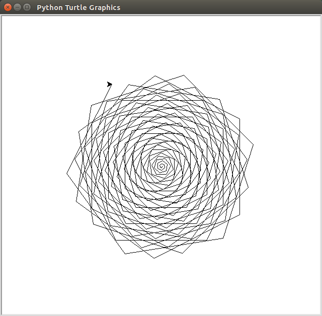
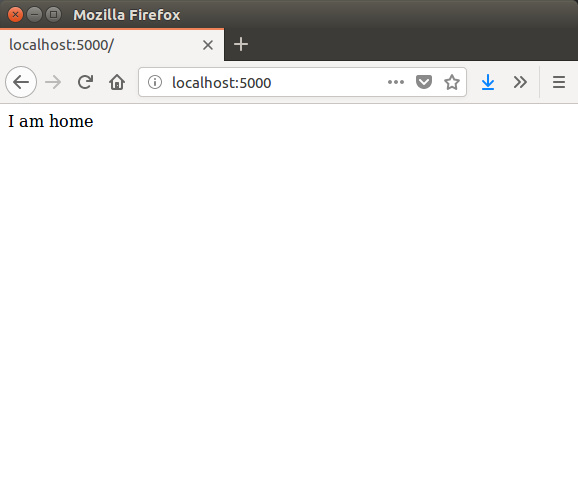
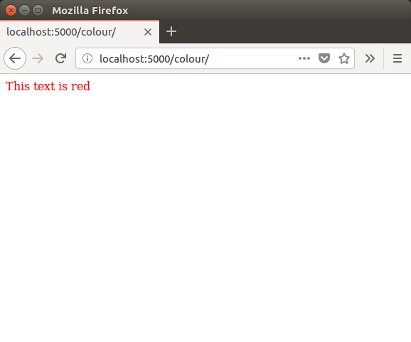

**Task:** Go to this url

[http://bit.ly/2D4YuEx](http://bit.ly/2D4YuEx)

Copy and fix the code with a partner

----

Solution
``` python
my_routine = ['wake up', 'shower', 'get the train', 'work', 'go home', 'eat', 'sleep']

days = ['mon', 'tues', 'wed', 'thurs', 'fri']

for day in days:
    print('Today is {}'.format(day))
    print('I need to')

    for item in my_routine:
        print(item)

    print('')
```


---

# Code First: Girls

#### Python Session 3

---

Session 4 in the course guide

Course guide content will be covered in Session 5

---

This session:
1. Logical Operators
1. If Statements
1. Importing Python libraries
1. Python pip
1. Flask
1. Jinja

---

### Logical Operators

----

**Logical Operators:** used to check if an expression is `True` or `False`

----

This code checks if the user has input `'Monday'` using the `==` operator

``` python
today = raw_input('What day is it? ')

is_monday = today == 'Monday'

print('Today is Monday: {}'.format(is_monday))
```

----

Operators in Python

Name | Python
---|---
Equal to | `==`
Not equal | `!=`
Greater than | `>`
Less than | `<`
Greater than or equal | `>=`
Less than or equal | `<=`

----

This code checks if today is not Monday
``` python
today = raw_input('What day is it? ')

is_not_monday = today != 'Monday'

print('Today is not Monday: {}'.format(is_not_monday))
```

----

**Task:** You have a budget of £10 and want to write a program to decide which burger restaurant to go to.

1. Input the `price` of a burger using `raw_input()`
1. Check whether the `price` is less than or equal (`<=`) `10.00`
1. Print the result in the format below

``` command-line
Burger is within budget: True
```

**Hint:** remember to convert the input from a string to a decimal with `float()`

----


Answer

``` python
price = raw_input('How much is a burger? ')

within_budget = float(price) <= 10.00

print('Burger is within budget: {}'.format(within_budget))

```

----

There are operators to combine multiple checks

Python | What it does
---|---
and | both expressions are `True`
or | at least one expression is `True`
not | reverse the expression (`True` becomes `False` and vice-versa)

----

``` python
today = raw_input('What day is it? ')
raining = raw_input('Is it sunny? (y/n)')

is_weekend = today == 'Saturday' or today == 'Sunday'
is_raining = raining == 'y'

is_beach_good_idea = is_weekend and not is_raining

print('You should go to the beach: {}'.format(is_beach_good_idea))
```
----

**Task:** Add code to your burger program to input whether the restaurant has a vegetarian option

The output should say whether the cost is within budget **AND** has a vegetarian option

``` command-line
Restaurant meets criteria: True
```

----

``` python
price = raw_input('How much is a burger? ')
vegetarian = raw_input('Is there a vegetarian option? (y/n) ')

within_budget = float(price) <= 10.00
has_vegetarian = vegetarian == 'y'

is_good_choice = within_budget and has_vegetarian

print('Restaurant meets criteria: {}'.format(is_good_choice))
```

---

### If Statements

----

**if statement:** used to run a block of code depending on whether a condition is `True` or `False`

----

``` python
password = raw_input('password: ')

if password == 'jumanji':
    print('Success!')

```

----

An `if` statement has the following:
1. The `if` keyword
1. A condition (logical operator expression)
1. A colon
1. Body (indented four spaces)

----

``` python

today = raw_input('What day is it? ')
raining = raw_input('Is it sunny? (y/n)')

is_weekend = today == 'Saturday' or today == 'Sunday'
is_raining = raining == 'y'

is_beach_good_idea = is_weekend and not is_raining

if is_beach_good_idea:
    print('You should go to the beach today!')

if not is_beach_good_idea:
    print('Don't go to the beach today')


```

----

**Task:** Rewrite the output of your burger program to use if statements

For example:

``` command-line
This restaurant is a great choice!
```

OR

``` command-line
Probably not a good idea
```

----

**else statement:** Used with an `if` statement and will run when the `if` condition is `False`


----

``` python
password = raw_input('password: ')

if password == 'jumanji':
    print('Success!')
else:
    print('Fail!')

```

----

``` python

today = raw_input('What day is it? ')
raining = raw_input('Is it sunny? (y/n)')

is_weekend = today == 'Saturday' or today == 'Sunday'
is_raining = raining == 'y'

is_beach_good_idea = is_weekend and not is_raining

if is_beach_good_idea:
    print('You should go to the beach today!')
else:
    print('Don't go to the beach today')


```

---

### Python Libraries

----

**Library/Module:** A collection of reusable code that someone else has written

Python has lots of useful built-in libraries and can be extended with third-party libraries.
----


The built-in turtle module is based on Logo and can be used to draw basic images

``` python
import turtle

turtle.forward(100)
turtle.right(90)

turtle.done()
```

**Tip:** Do not save this file as `turtle.py`

Note: drawing_with_turtle.py

----


----

Imported libraries can be mixed with other Python expressions

``` python

import turtle

for index in range(4):
    turtle.forward(100)
    turtle.right(90)

turtle.done()

```

Note: square_turtle.py

----


----

The built-in random module is used to generate random numbers

``` python
from random import randint

number = randint(1, 10)

print(number)
```

Tip: **Do not** save this program as `random.py`

Note: random_example.py

----

**Task:** Using the **turtle** and **random** modules, draw a spiral with a random angle



----

Solution:

``` python
import turtle
from random import randint

angle = randint(45, 90)

for length in range(200):
    turtle.forward(length)
    turtle.right(angle)

turtle.done()
```
---

### Python Pip

----

**pip:** A package manager used to install libraries that other people have written

----

pip is used via the terminal (command-line)


----

We want to install Flask using pip using the Terminal

``` command-line
pip install flask
```

----

Flask is installed along with the packages it depends on

``` command-line
Successfully installed Jinja2-2.10 MarkupSafe-1.0 Werkzeug-0.14.1 click-6.7 flask-0.12.2 itsdangerous-0.24
```

---

### Flask: Routing

----

**Flask:** A Python library for building programs that run on the web, including websites and APIs.

Flask manages things like routing and rendering templates so that you can focus on writing your application's code.

----

``` python
from flask import Flask
app = Flask(__name__)


@app.route('/')
def home():
    return 'I am home'


app.run(debug=True)
```

Note: flask_home.py

----

After running the Python program, you can view the website at [localhost:5000](http://localhost:5000)

----



----

The `@app.route()` code is a **function decorator**.

It tells Flask to run a function when someone goes to a specific url route

----

This adds [localhost:5000/about/](http://localhost:5000/about/)

``` python
from flask import Flask
app = Flask(__name__)


@app.route('/')
def home():
    return 'I am home'


@app.route('/about/')
def about():
    return 'This is a Flask website'


app.run(debug=True)
```


**Tip:** Remember to include the second forward slash after `'about'`

Note: flask_about.py

----

**Task:** Add each of these routes and make them return the following values

Route | Return
--- | ---
/hello/ | `"Hello"`
/add/2/2/ | 2 + 2

----

Solution

``` python

@app.route('/hello/')
def hello():
    return 'Hello'


@app.route('/add/2/2/')
def add():
    return str(2 + 2)

```

Note: flask_hello_and_add.py

---

### Flask: Dynamic Routes

----

So far our Flask app only has fixed routes

Flask can also handle dynamic routing


----

Change your code for the `'/hello/'` route

``` python
@app.route('/hello/<name>/')
def hello(name):
    return 'Hello {}'.format(name)

```

In the web browser go to

- [http://localhost:5000/hello/kitty/](http://localhost:5000/hello/kitty/)
- [http://localhost:5000/hello/sailor/](http://localhost:5000/hello/sailor/)
- [http://localhost:5000/hello/friend/](http://localhost:5000/hello/friend/)

Note: flask_dynamic_routing

----

``` python
@app.route('/add/<num_1>/<num_2>/')
def add(num_1, num_2):
    result = int(num_1) + int(num_2)
    return str(result)

```

- [http://localhost:5000/add/1/2/](http://localhost:5000/add/1/2/)
- [http://localhost:5000/add/1/2/](http://localhost:5000/add/5/7/)
- [http://localhost:5000/add/1/2/](http://localhost:5000/add/98659/865/)


Note: flask_dynamic_routing.py

----

**Task:** I want to calculate the area of a circle using my Flask app. Use the following code as a starting point

``` python
def circle_area(radius):
    area = 3.14 * (radius ** 2)
    return area
```

For a circle with radius 5, the url should look like this [http://localhost:5000/circle/5/](http://localhost:5000/circle/5/)


----

Solution

``` python
@app.route('/circle/<radius>/')
def circle_area(radius):
    radius = int(radius)
    area = 3.14 * (radius ** 2)

    return str(area)
```

Note: flask_circle.py


----

DO NOT USE `raw_input()` WITH FLASK


---

### Flask: HTML with Jinja

----

Jinja is a template format for using HTML with Python

Flask looks for Jinja templates in the `templates` folder

----

1. Create a Python file called `colours_html.py`

1. Next to the file create a `templates` folder

1. In the `templates` folder create a file called `colour.html`

----


----

`colours_html.py`

``` python
from flask import Flask, render_template

app = Flask(__name__)


@app.route('/colour/')
def show_colour():
    return render_template('colour.html')


app.run(debug=True)
```

----

`colour.html`

``` html
<html>
    <body>
        <div style="color: red">
            This text is red
        </div>
    </body>
</html>
```

----




----

Similar to string formatting, Jinja templates have arguments

``` html
<html>
    <body>
        <div style="color: {{colour}}">
            This text is {{colour}}
        </div>
    </body>
</html>
```

----

``` python
from flask import Flask, render_template

app = Flask(__name__)


@app.route('/colour/<colour>/')
def show_colour(colour):
    return render_template('colour.html', colour=colour)


app.run(debug=True)
```

----

**Task:** Create a new html file called `size.html`. When I go to `localhost:5000/size/12/` it should show some text in that font size

``` html
<html>
    <body>
        <div style="font-size: {{size}}pt">
            This text is {{size}}
        </div>
    </body>
</html>
```

----

Solution
``` python
from flask import Flask, render_template

app = Flask(__name__)


@app.route('/size/<size>/')
def show_colour(size):
    return render_template('size.html', size=size)


app.run(debug=True)
```

----

You can use for loops to repeat blocks of HTML

'''html
<html>
    <body>
    <ul>
    
        <li>fruit</li>
    
    </ul>
    </body>
</html>
'''

----

``` python
from flask import Flask, render_template

app = Flask(__name__)


@app.route('/size/<size>/')
def show_fruits(size):
    fruits = ['apple', 'banana', 'pear']

    return render_template('fruit.html', fruits=fruits)


app.run(debug=True)
```

----

----

The course guide has an example of using if statements and css inside Jinja templates

---

### Flask: Forms

----

Covered in the course guide "Getting user generated data from your webpage to Python"

---

### Recap

---

Setup a Twitter account for next week

---

### Homework

[http://bit.ly/2D3vSLN](http://bit.ly/2D3vSLN)

----
