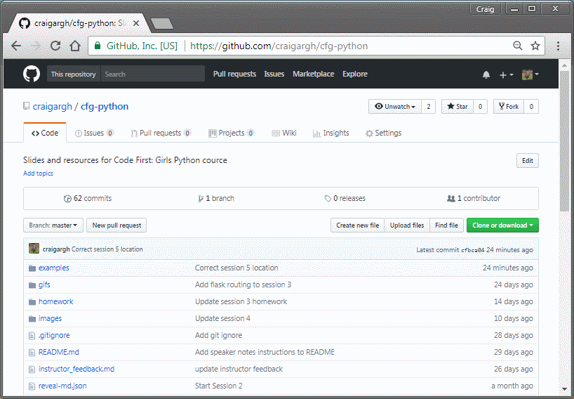

Install Git

---

# Code First: Girls

#### Python Session 5

---

This session
1. Git/Source Control
1. Project planning

---

### Git

----

Version/source control is useful when working as part of a team.

Git is the most widely used source control software.

GitHub is a website that allows you to host Git repositories.

----

A Git repository stores the versions of your application's code in a single location.

----

One person on your team will need to create the repository using their GitHub account

----

Go to [github.com](http://www.github.com) and log in

----

Click on the `Start a Project` button

OR

Click on the `+` icon on the right of the navbar, `New repository`

----

Choose a name for your project and click `Create repository`

----

So that other team members can contribute, you need to add them as Collaborotors

On the project's repository
1. Go to the `Settings` tab
1. Click `Collaborators` on the menu at the left hand side
1. Enter their username/email address and click `Add collaborator`

---

### Git: Commits and Pulling Code
----

Before doing anything else, we need to connect our GitHub account with PyCharm

----

----

You can copy the code from the central respository. This is called **cloning** the repository.

----

----

The repository keeps track of changes to the code. Each group of changes is called a **commit**.

Each commit has a commit message and a record of the code it changes.

----

[An example Commit](https://github.com/craigargh/cfg-python/commit/57ae352f7211b9584369a4caf154d0bc903a70f9)

----

You can make changes to the code on your computer. You can then **commit** and **push** them from your computer to the central repository.

----

----

**Task:** Create a new text file called `<your_name>.txt`

Commit and push it to the Git repository

----

When there are updates to the code you can **pull** these changes into the copy on your computer.

----

----

Sometimes when two people work on the same file separately, there will be incompatible changes.

Git calls this a conflict

----

WHAT A CONFLICT LOOKS LIKE

----

HOW TO FIX A CONFLICT IN PYCHARM

----

Using Git with the command-line resources:
- https://try.github.io/
- https://github.com/git-school/workshop-setup
- https://www.youtube.com/watch?v=BCQHnlnPusY

---

### Projects!!!

----

- Groups of 2-3 people
- Presentations in second half of Session 8
- Should use Flask
- APIs/Python libraries

----

How to plan a project:
- Explain the purpose of your application
- Make a list of requirements
- Prioritise your requirements (Must, Should, Could, Won't)
- Minimum Viable Product (MVP)

---
