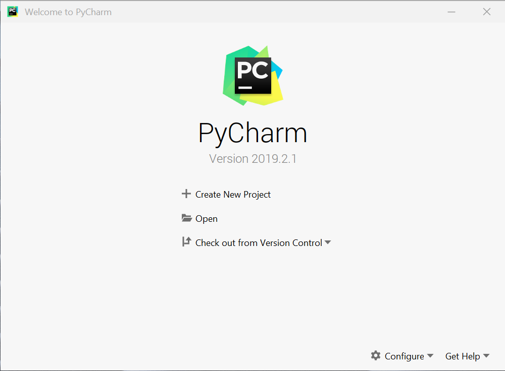
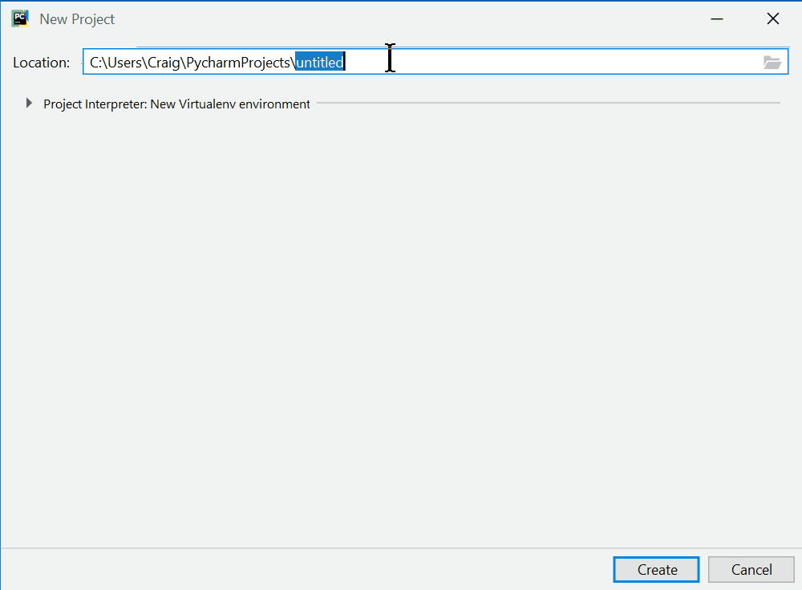
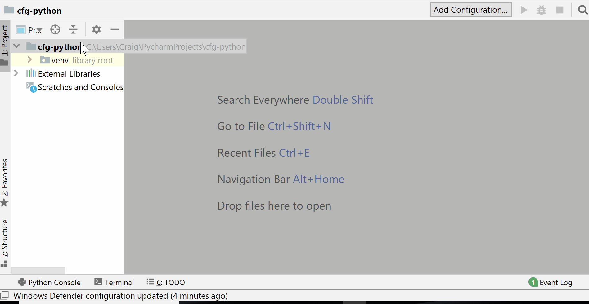
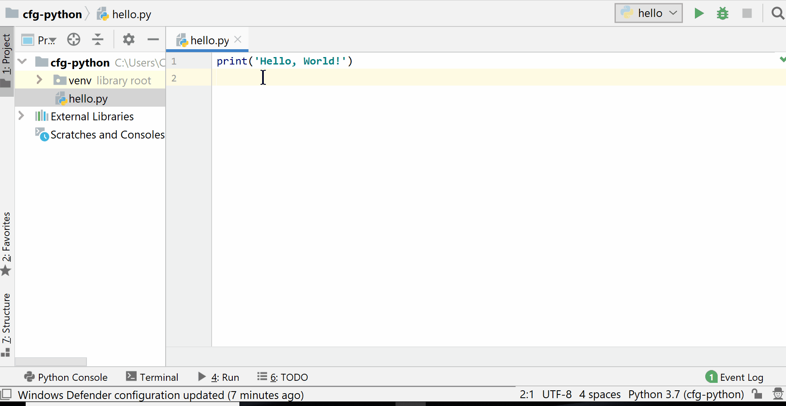
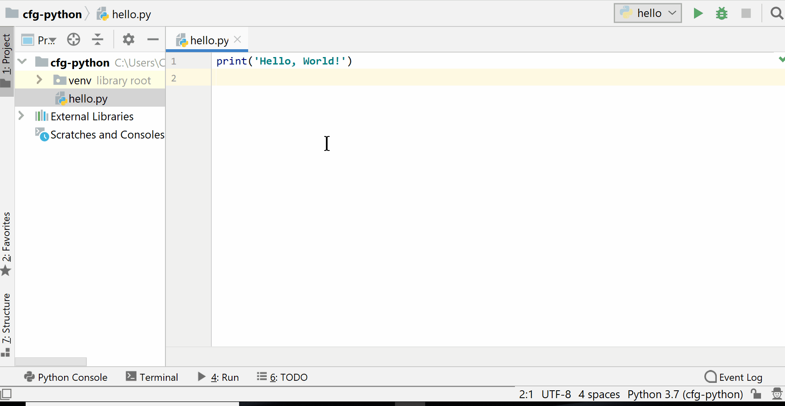

Make sure that you have installed:
1. Python 3.7 (www.python.org/downloads/)
1. PyCharm Community Edition (www.jetbrains.com/pycharm/download/)

---


#### Python Session 1

----

Course overview:

1. Data types, variables and operations
1. Input, loops and functions
1. If statements
1. Lists and dictionaries
1. Files, modules and APIs
1. Project planning and group project 
1. Group project
1. Group project and presentations

----

Instructor Introductions

----

Put a coloured Post-It note on the back of your laptop monitor during exercises:
- Red/pink: I need instructor support
- Green: I do not need instructor support

----

Topics this session:

1. Run Python with files and console
1. Recognise data types (Integers, Floats and Strings)
1. Identify different maths operations
1. Understand Error Messages
1. Use variables in your programs

----

PyCharm

---

### Why Python?

----

> **Programming Language:** A language with a set of rules that are used to communicate instructions to a computer

> **Program:** A set of instructions that are run by a computer

----


----

Python:

1. Designed to be readable
1. Wide selection of 3rd party libraries
1. Popular
1. Open Source

---

### Your first Python Program

----

Open PyCharm and click `Create New Project`



----

Call the project `cfg-python`

Under `Project Interpreter: New Virtualenv environment`, set Base interpreter to Python 3.7



----

Right click on `cfg-python` > `New` > `Python File`

Name the file `hello` (`.py` is added automatically)



----

Add this code to `hello.py`

```python
print('Hello, World!')
```

----

Right-click in your new file >  `Run 'hello'`



----

🎉 Congratulations! 🎉 

You've just run your first Python program

----

**Function:** A reusable piece of code that completes a specific task

You can recognise a function as they are a word followed by round brackets `()` e.g. `print()`

----

The `print()` function is used to output a message to the programmer

You can change the data given to the function to change the output

```python
print('I hope it is sunny this weekend')
```

----

**Exercise 1.1:** Now that you've run your first program, try the following:

- Change the message to anything you want
- Repeat the code on multiple lines to output several messages
- Find out what happens when you remove different parts of the code (e.g. brackets)

Don't worry if something unexpected happens. Think about what you changed and why it might have caused it to happen.

---

### Numbers and Operators in Python

----

**Integer:** a Python **data type** for **whole numbers**. For example `5`, `-99` and `1048` are all integers.

**Float:** a Python **data type** for **decimal numbers**. For example `5.6`, `9.0` and `-67.1001` are all floats.

----

Opening the Python Console



----

**Exercise 1.2:** Type these lines into your **Python console**:

```python
5 - 6
8 * 9
6 / 2
5 / 0
5.0 / 2
5 % 2
2 * (10 + 3)
2 ** 4
```

What does each one do and what is its output?

Are there any outputs you didn't expect?

----
Subtraction:
```python
5 - 6
```

Multiplication:
```python
8 * 9
```

Division:
```python
6 / 2
```

Division by zero:
```python
5 / 0
```

Float division:
```python
5.0 / 2
```

Modulo (remainder):
```python
5 % 2
```

Brackets:
```python
2 * (10 + 3)
```

Exponent (x to the power of y)
```python
2 ** 4
```

----

Operator types
* `+`: add
* `-`: subtract
* `*`: multiply
* `/`: division
* `**`: exponent
* `%`: modulo (remainder)

---

## Python Console

----

There are two main ways to write and run Python programs:
1. With files 
1. On the Python console (also called the shell)

----

Python File | Python Console
---|---
Runs all lines from top-to-bottom | Runs one line as it is entered
Only shows output when using `print()` | Shows output for every line
For code that will be ran multiple times | Interactive for exploration

---

### The String Data Type

----

**String:** a Python data type for **text** and **characters**.

For example `'Hello'`, `"abcdef1234"` and `'cats'` are all strings

----

Strings must be written between a pair of single or double speech marks

 `'...'` or `"..."`


```python
"This is a string"
```

```python
'This is also a string'
```

----
Forgetting the speech marks

```python
hello
```

Will cause this exception

```bash
Traceback (most recent call last):
  File "<stdin>", line 1, in <module>
NameError: name 'hello' is not defined
```

----
To fix it add speech marks


```python
"hello"
```

----

The `*` and `+` operators work on strings as well as integers.

Let's investigate what they do

----

**Exercise 1.3:**

In your **Python console** type each of these

```python
"Cat"
"Cat" + " videos"

"Cat" * 3
"Cat" + 3

"Cat".upper()
"Cat".lower()

"the lord of the rings".title()
```

What is the output for each one and why?

One of them causes an exception. Read the exception message. What do you think it means?

----

Results:

```python
"Cat"
```

```python
"Cat" + " videos"
```

```python
"Cat" * 3
```

```python
"Cat" + 3
```

```python
"Cat".upper()
```

```python
"Cat".lower()
```

```python
"the lord of the rings".title()
```

----

1. The `+` operator can join two strings together, this is called **concatenation**

1. The `*` operator repeats a string a number of times

1. `.upper()`, `.lower()` and `.title()` are **methods**

----

**method:** A repeatable piece of code that completes a task for specific data-type

Methods are like funcitons, but they are tied to a specific data-types e.g. `.upper()` can only used with a string and not an integet or a float

----

Running this code

```python
print("Cat" + 3)
```

Will cause this exception

```bash
Traceback (most recent call last):
  File "<stdin>", line 1, in <module>
TypeError: can only concatenate str (not "int") to str
```

----

Putting a number in `str()` converts it to a string

```python
print("Cat" + str(3))
```

---

### Variables

----

**Variable:** a reusable **label** for a data value in Python

----

Creating (assigning) a variable has three parts:
1. The variable's name
1. An equals sign `=`
1. The data value it references

```python
username = 'sarah_1987'
age = 23
```

----

Values and variables are interchangeable

A variable can be put anywhere that a data value can be used

```python
print('spaghetti')
```


```python
food = 'spaghetti'
print(food)

```

----

Variables can be reused. This program calculates the cost of 12 oranges. 

```python
oranges = 12
cost_per_orange = 0.5

total_cost = oranges * cost_per_orange

print(str(oranges) + " oranges")
print("costs " + str(total_cost))
```

The `oranges` variable is reused twice in the program

----

**Exercise 1.4:** In a new Python **file** called `cat_food.py`, create a program that calculates how many cans of cat food you need to feed 10 cats

Your will need:
1. A **variable** for the number of **cats**
1. A **variable** for the number of **cans** each cat eats in a day
1. A `print()` function to output the result

**Extension:** change the calculation to work out the amount needed for 7 days

----

An Example Solution
```python
cats = 10
cans = 2

total_cans = cats * cans

output = str(cats) + " cats eat " + str(total_cans) + " cans"
print(output)
```

----

Extension Solution

```python
cats = 10
cans = 2
days = 7

total_cans = cats * cans * days

msg = str(cats) + " cats eat " + str(total_cans) + " cans in " + str(days) + " days"
print(msg)
```

---

### String Formatting

----

Python strings have a method (`.format()`) that substitutes placeholders `{}` for values

```python
oranges = 12
cost_per_orange = 0.5

total_cost = oranges * cost_per_orange

output = "{} oranges costs £{}".format(oranges, total_cost)

print(output)
```

----

This could have been written as:

```python
oranges = 12
cost_per_orange = 0.5

total_cost = oranges * cost_per_orange

output = str(oranges) + " oranges costs £" + str(total_cost)

print(output)
```

----

**Exercise 1.5:** Rewrite `cat_food.py` to use string formatting instead of joining strings with `+`.

An example of string formatting:

```python
user_name = 'sarah_1987'
age = 23

output = '{} is {} years old'.format(user_name, age)
print(output)
```

----

Solution

```python
cats = 10
cans = 2

total_cans = cats * cans

output = "{} cats eat {} cans".format(cats, total_cans)
print(output)
```

---


### Comments

----

**Comment:** a way for a programmer to write human-readable notes in their code. When running a program, comments are ignored by Python.

```python
# This is a comment
```


----

Comments in Python start with a `#`

```python
# A program to calculate the cost of some oranges

oranges = 12
cost_per_orange = 0.5

total_cost = oranges * cost_per_orange

output = "{} oranges costs £{}".format(oranges, total_cost)

print(output)
```

---

### Recap

----

1. Run Python with files and console
1. Data types (Integers, Floats and Strings)
1. Maths operations
1. Understanding Error Messages
1. Variables


----

**Question 1:** What are the names of the maths operators?

----

**Question 2:** In what situation should you use a Python file and when should you use the Python Console?

----

**Question 3:** What is the output of this code?

```python
days = 31
hours = "24"
total_hours = days * hours

msg = "There are {} in {} days".format(total_hours, days)
print(msg)
```

---

**Homework:** Session 1 homework questions in your student guide
