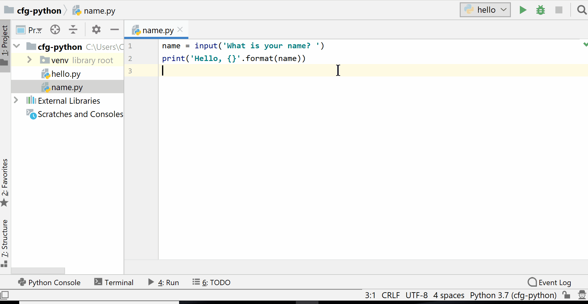

**Starter:** There are three mistakes in this program. What are the mistakes and how do you fix them?

```python
name = Jess
age = 20

print('My name is {} and I am {} years old').format(age, name) 
```

---


#### Python Session 2

----

This session:

1. User Input
1. Importing modules
1. Problem solving with Turtle
1. For Loops
1. Functions

----

By the end of this you will be able to:

- Construct programs that use user input
- Describe the purpose of Python modules
- Solve problems to create drawings using the Turtle module
- Modify duplicated code to use for Loops 
- Construct reusable functions

---


### User Input

----

The `input()` function allows you to input data after the program has started running

----

This program uses input to ask what your name is

```python
name = input('What is your name? ')
print('Hello, {}'.format(name))
```
----



----

**Exercise 2.1:** Write a program that asks two questions using `input()` then prints the values that were entered. You can choose any questions that you want.

Example:

```python
animal = input('Do you like dogs or cats more? ')
pet_name = input('What would name your pet? ')

print('You like {} and you would name your pet {}'.format(animal, pet_name))
```

----

The `int()` function converts string value into integer values:

```python
apples_string = '12'
total_apples = int(apples_string) + 5

print(total_apples) 
```

----

The `input()` always returns a string value. You can convert this string value to an integer with `int()`:

```python
purchased_apples = input('How many apples did you buy? ')
total_apples = int(purchased_apples) + 5

print(total_apples)
```

----

**Exercise 2.2:** You have friends at your house for dinner and you've accidentaly burnt the lasagne. Time to order pizza.

Write a program calculate how many pizzas you need to feed you and your friends

```python
friends = # Add input here
pizzas = friends * 0.5

print('You need {} pizzas for {} friends'.format(pizzas, friends))
```

----

Solution

```python
friends = int(input('How many friends are at your house? '))
pizzas = friends * 0.5

print('You need {} pizzas for {} friends'.format(pizzas, friends))
```

---

### Python Modules

----

**Module:** Code that someone else has written that you can reuse in your programs

----

Modules are imported into your Python programs:

```python
import turtle
```

Turtle is module for creating basic drawings.


---

### Problem Solving (with Turtle)

----

After importing a module you can use the module's functions:

```python
import turtle

turtle.forward(100)
turtle.right(130)
turtle.forward(100)

turtle.done()
```

----

`turtle.forward(100)` moves the turtle forward by a number of pixels

`turtle.right(130)` rotates the turtle by a number of degrees

`turtle.done()` tells the turtle that you've finished giving it commands. Without this it will wait for new commands (if run from the shell) or disappear (if run from file).

----

You can change the turtle's speed:

- `turtle.speed('slowest')` for slow
- `turtle.speed('fastest')` for fast


----

A square has **four** sides and an angle of **ninety** degrees:

```python
import turtle

turtle.forward(100)
turtle.right(90)

turtle.forward(100)
turtle.right(90)

turtle.forward(100)
turtle.right(90)

turtle.forward(100)
turtle.right(90)

turtle.done()
```

----

Variables can be used to set the angles and size of your shapes:

```python
import turtle

side_length = 200
angle = 90

turtle.forward(side_length)
turtle.right(angle)

turtle.forward(side_length)
turtle.right(angle)

turtle.forward(side_length)
turtle.right(angle)

turtle.forward(side_length)
turtle.right(angle)

turtle.done()
```

----

You can play around with filling the shape and colors:

```python
import turtle

side_length = 200
angle = 90

turtle.color('red', 'pink')
turtle.begin_fill()

turtle.forward(side_length)
turtle.right(angle)

turtle.forward(side_length)
turtle.right(angle)

turtle.forward(side_length)
turtle.right(angle)

turtle.forward(side_length)
turtle.right(angle)

turtle.end_fill()

turtle.done()
```

----

**Exercise 2.3:** Create a new file called `triangle.py`. Using `turtle` draw a triangle.

A triangle has **three** sides and an angle of **120** degrees

**Extension:** Make the triangle blue

----

Solution

```python
import turtle

side_length = 100
angle = 120

turtle.forward(side_length)
turtle.right(angle)

turtle.forward(side_length)
turtle.right(angle)

turtle.forward(side_length)
turtle.right(angle)

turtle.done()
```

----

Extension Solution

```python
import turtle

side_length = 100
angle = 120

turtle.color('blue', 'blue')
turtle.begin_fill()

turtle.forward(side_length)
turtle.right(angle)

turtle.forward(side_length)
turtle.right(angle)

turtle.forward(side_length)
turtle.right(angle)


turtle.end_fill()

turtle.done()
```

---


### For Loops

----

**`for` loop:** allows you to repeat a block of code multiple times

```python 
for number in range(100):
    print(number)
```

----

A `for` loop has
- A `for` operator
- A variable name that stores each list value one at a time
- An `in` operator
- A list of values
- A body (indented four spaces)


----

The pre-written `range()` function can be used to make a `for` loop repeat a certain number of times. 

The `range()` function starts counting from `0`

```python
for number in range(5):
    print(number)
```

----

For loops are really useful for repeating code. Notice in the original code for the square that you repeat the same bit of code four times:

```python
import turtle

side_length = 200
angle = 90

turtle.forward(side_length)
turtle.right(angle)

turtle.forward(side_length)
turtle.right(angle)

turtle.forward(side_length)
turtle.right(angle)

turtle.forward(side_length)
turtle.right(angle)

turtle.done()
```

----

Using a for loop you can simplify the program:

```python
import turtle

side_length = 200
angle = 90

for side in range(4):
    turtle.forward(side_length)
    turtle.right(angle)

turtle.done()
```


----

**Exercise 2.4: Choose your sides**

In this exercise you'll create a program that can draw shapes with any number of sides.

When you run the program it will ask you to input the number of sides that the shape should have. The program will then calculate the correct angle for the shape and draw it for you.

I've started the program for you:

```python
import turtle

sides = int(input('Number of sides: ')) 

angle = 360 / sides
side_length = 60

# Add the for loop here
turtle.forward(side_length)
turtle.right(angle)

turtle.done()
```

----

Solution


```python
import turtle

sides = int(input('Number of sides: ')) 

angle = 360 / sides
side_length = 60

for side in range(sides):
    turtle.forward(side_length)
    turtle.right(angle)

turtle.done()
```

---


### Functions

----

**Function:** A reusable block of code

----

```python
import turtle


def square():
    side_length = 100
    angle = 90

    for side in range(4):
        turtle.forward(side_length)
        turtle.right(angle)
```

----

All functions have
1. a `def` operator
1. a name
1. brackets
1. a colon
1. body (indented 4 spaces)

----

You write a function with its name and brackets `()` to use/call it e.g. `square()`

```python
import turtle


def square():
    side_length = 100
    angle = 90

    for side in range(4):
        turtle.forward(side_length)
        turtle.right(angle)


square()
```
----

Functions can be called many times

```python
import turtle


def square():
    side_length = 100
    angle = 90

    for side in range(4):
        turtle.forward(side_length)
        turtle.right(angle)


square()
turtle.forward(150)
square()
```

----

**Exercise 2.5:** Create a function that draws a triangle using turtle.

----

Solution

```python
import turtle


def triangle():
    side_length = 100
    angle = 120

    for side in range(3):
        turtle.forward(side_length)
        turtle.right(angle)


triangle()
```
---

### Function Arguments

----

**Argument:** A piece of data that is given to a function when it is called

----

Arguments go inside the brackets and behave like variables

```python
import turtle


def square(side_length):
    angle = 90

    for side in range(4):
        turtle.forward(side_length)
        turtle.right(angle)

square(60)
square(100)
```

----

**Exercise 2.6:** Modify your triangle function so that you can set the **side length** using an argument

**Extension:** Use a second argument to set the **colour** of the triangle

----

Solution

```python
import turtle


def triangle(side_length):
    angle = 120

    for side in range(3):
        turtle.forward(side_length)
        turtle.right(angle)


triangle(400)
triangle(300)
triangle(200)
triangle(100)
```
----

Extension:

```python
import turtle


def triangle(side_length, colour):
    angle = 120
    
    turtle.color(colour, colour)
    turtle.begin_fill()

    for side in range(3):
        turtle.forward(side_length)
        turtle.right(angle)

    turtle.end_fill()


triangle(400, 'red')
triangle(300, 'pink')
triangle(200, 'blue')
triangle(100, 'yellow')
```

----

Functions can have multiple arguments seperated by commas

```python
import turtle


def square(side_length, colour):
    angle = 90

    turtle.color(colour, colour)
    turtle.begin_fill()

    for side in range(4):
        turtle.forward(side_length)
        turtle.right(angle)

    turtle.end_fill()

square(400, 'red')
square(300, 'pink')
square(200, 'blue')
square(100, 'yellow')
```

---

### Returning Values from Function

----

Values can be returned from functions using the `return` operator

```python
def add(num_1, num_2):
    return num_1 + num_2


total_height = add(182, 160)

print(total_height)
```

----

**Exercise 2.7:** Complete the function to return the area of a circle


Use the comments to help you

```python
def circle_area():  # add the radius argument inside the brackets
    area = 3.14 * (radius ** 2)
    # return area here


circle_1 =  circle_area(10)

print(circle_1)

```

----

Solution

```python
def circle_area(radius):
    area = 3.14 * (radius ** 2)
    return area

area = circle_area(9)

print(area)
```
---


### Recap

----

This session:

1. Importing modules
1. Problem solving with Turtle
1. For Loops
1. Functions

----

**Question 1:** What is a Python module?

----

**Question 2:** What is more suitable name for this function?

```python
def x(days):
    minutes = days * 24 * 60
    return minutes

print(x(10))
```

----

**Question 3:** Why won't this program run?

```python
for number in range(100)
print(number)
```

---

**Homework:** Session 2 homework questions in your student guide
