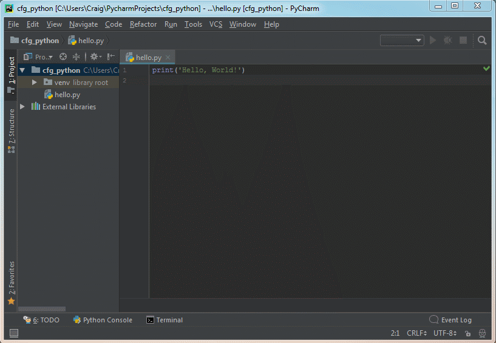

# Code First: Girls

#### Python Session 4

---

This session
1. Pip package manager
1. APIs
1. Flask and Jinja

---

### Python Pip

----

**pip:** A package manager used to install libraries that other people have written

----

pip is used via the terminal (command-line)



----

Install the `requests` library using pip

``` command-line
pip install requests
```

---

### APIs: Reading Stuff

----

**Application Programming Interface (API):** A way to interact with another application from your code through requests.

Web APIs allow you to do this over the internet.

----

Pokéapi is an API to get data about Pokémon

[pokeapi.co/](https://pokeapi.co/)

----

You can retrieve information about different Pokemon from urls

[https://pokeapi.co/api/v2/pokemon/6/](https://pokeapi.co/api/v2/pokemon/6/)

----


Save this as `get_pokemon.py`

``` python
import requests

url = 'https://pokeapi.co/api/v2/pokemon/151/'

response = requests.get(url)
print(response)

pokemon = response.json()
print(pokemon['name'])
```

Outputs
``` command-line
<Response [200]>
mew
```

Note: get_pokemon.py

----

Reponse status codes:

Status Code | Name | Explanation
--- | --- | ---
200 | OK | The request worked
404 | Not found | Couldn't find the url you requested
400 | Bad request | The request you made isn't understood


----

**Task:** Get the *height* and *weight* of the Pokemon and print the output

Add `input()` to choose which Pokemon you want information about

----

Solution

``` python
import requests

pokemon_number = input("What is the Pokemon's ID? ")

url = 'https://pokeapi.co/api/v2/pokemon/{}/'.format(pokemon_number)

response = requests.get(url)
pokemon = response.json()

print(pokemon['name'])
print(pokemon['height'])
print(pokemon['weight'])
```

Note: get_pokemon_height.py

---

### Flask: Routing

----

**Flask:** A Python library for building programs that run on the web, including websites and APIs.

Flask manages things like routing and rendering templates so that you can focus on writing your application's code.

----


We want to install Flask using pip using the Terminal

``` command-line
pip install flask
```

----

Flask is installed along with the packages it depends on

``` command-line
Successfully installed Jinja2-2.10 MarkupSafe-1.0 Werkzeug-0.14.1 click-6.7 flask-0.12.2 itsdangerous-0.24
```

----

``` python
from flask import Flask
app = Flask(__name__)


@app.route('/')
def home():
    return 'I am home'


app.run(debug=True)
```

Note: flask_home.py

----

After running the Python program, you can view the website at [localhost:5000](http://localhost:5000)

----


----

The `@app.route()` code is a **function decorator**.

It tells Flask to run a function when someone goes to a specific url

The function should return a either `string` or a `response` (covered later)

----

This adds [localhost:5000/about/](http://localhost:5000/about/)

``` python
from flask import Flask
app = Flask(__name__)


@app.route('/')
def home():
    return 'I am home'


@app.route('/about/')
def about():
    return 'This is a Flask website'


app.run(debug=True)
```


**Tip:** Remember to include the second forward slash after `'about'`

Note: flask_about.py

----

**Task:** Add each of these routes and make them return the following values

Route | Return
--- | ---
/hello/ | `"Hello"`
/add/2/2/ | 2 + 2

----

Solution

``` python

@app.route('/hello/')
def hello():
    return 'Hello'


@app.route('/add/2/2/')
def add():
    return str(2 + 2)

```

Note: flask_hello_and_add.py

---

### Flask: Dynamic Routes

----

So far our Flask app only has fixed routes

Flask can also handle dynamic routing


----

Change your code for the `'/hello/'` route

``` python
@app.route('/hello/<name>/')
def hello(name):
    return 'Hello {}'.format(name)

```

In the web browser go to

- [http://localhost:5000/hello/kitty/](http://localhost:5000/hello/kitty/)
- [http://localhost:5000/hello/sailor/](http://localhost:5000/hello/sailor/)
- [http://localhost:5000/hello/friend/](http://localhost:5000/hello/friend/)

Note: flask_dynamic_routing

----

``` python
@app.route('/add/<num_1>/<num_2>/')
def add(num_1, num_2):
    result = int(num_1) + int(num_2)
    return str(result)

```

- [http://localhost:5000/add/1/2/](http://localhost:5000/add/1/2/)
- [http://localhost:5000/add/5/7/](http://localhost:5000/add/5/7/)
- [http://localhost:5000/add/98659/865/](http://localhost:5000/add/98659/865/)


Note: flask_dynamic_routing.py

----

**Task:** I want to calculate the area of a circle using my Flask app. Use the following code as a starting point

``` python
def circle_area(radius):
    area = 3.14 * (radius ** 2)
    return area
```

For a circle with radius 5, the url should look like this [http://localhost:5000/circle/5/](http://localhost:5000/circle/5/)


----

Solution

``` python
@app.route('/circle/<radius>/')
def circle_area(radius):
    radius = int(radius)
    area = 3.14 * (radius ** 2)

    return str(area)
```

Note: flask_circle.py


----

DO NOT USE `input()` WITH FLASK


---

### Flask: HTML with Jinja

----

Jinja is a template format for using HTML with Python

Flask looks for Jinja templates in the `templates` folder

----

1. Create a Python file called `colours_html.py`

1. Next to the file create a `templates` folder

1. In the `templates` folder create a file called `colour.html`

----


----

`colours_html.py`

``` python
from flask import Flask, render_template

app = Flask(__name__)


@app.route('/colour/')
def show_colour():
    return render_template('colour.html')


app.run(debug=True)
```

----

`colour.html`

``` html
<html>
    <body>
        <div style="color: red">
            This text is red
        </div>
    </body>
</html>
```

----


----

Similar to string formatting, Jinja templates have arguments

``` html
<html>
    <body>
        <div style="color: {{colour}}">
            This text is {{colour}}
        </div>
    </body>
</html>
```

----

``` python
from flask import Flask, render_template

app = Flask(__name__)


@app.route('/colour/<colour>/')
def show_colour(colour):
    return render_template('colour.html', colour=colour)


app.run(debug=True)
```

----

**Task:** Create a new html file called `size.html`. When I go to `localhost:5000/size/12/` it should show some text in that font size

``` html
<html>
    <body>
        <div style="font-size: {{size}}pt">
            This text is {{size}}
        </div>
    </body>
</html>
```

----

Solution
``` python
from flask import Flask, render_template

app = Flask(__name__)


@app.route('/size/<size>/')
def show_colour(size):
    return render_template('size.html', size=size)


app.run(debug=True)
```

----

You can use for loops to repeat blocks of HTML

```html
<html>
    <body>
    <ul>
    
        <li>fruit</li>
    
    </ul>
    </body>
</html>
```

----

``` python
from flask import Flask, render_template

app = Flask(__name__)


@app.route('/size/<size>/')
def show_fruits(size):
    fruits = ['apple', 'banana', 'pear']

    return render_template('fruit.html', fruits=fruits)


app.run(debug=True)
```

----

----

The course guide has an example of using if statements and css inside Jinja templates

---

### Flask: Forms

----

Covered in the course guide "Getting user generated data from your webpage to Python"

---


### Recap

----

This session
1. Pip package manager
1. Getting data with an API
1. Flask and Jinja

---

PROJECTS
