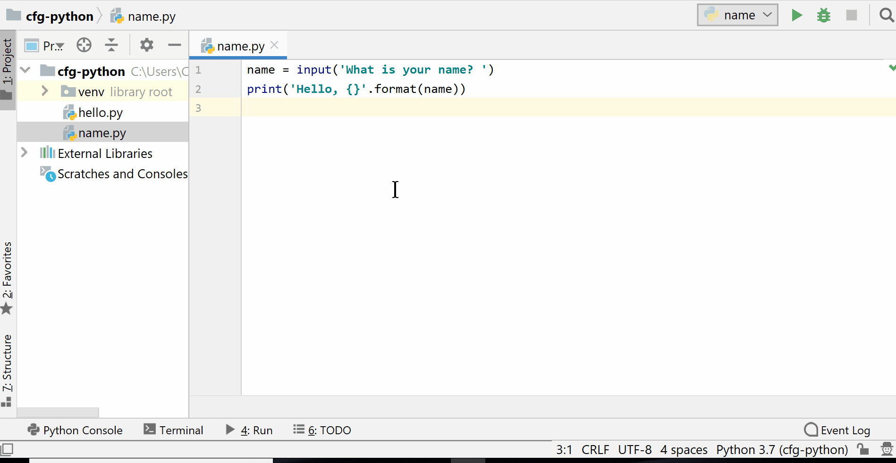

**Starter:** How do I output the `species` values for each of the dictionaries?

```python
[
    {'species': 'zebra', 'name': 'Penelope'},
    {'species': 'penguin', 'name': 'Jenn'},
    {'species': 'elephant', 'name': 'Harris'},
    {'species': 'flamingo', 'name': 'Florence'},
]

```

---


#### Python Session 5

---

This session
1. Files
1. Pip package manager
1. APIs

----

By the end of this session you will be able to:

- Create programs that read and write to files
- Explain the purpose of the pip package manager
- Gather data using web APIs

---

### Reading/Writing Files

----

Writing to a file

```python
with open('people.txt', 'w+') as text_file:
    people = 'Joanne \nSusan \nAmina'

    text_file.write(people)
```

----

Reading from a file

```python
with open('people.txt', 'r') as text_file:
    contents = text_file.read()

print(contents)
```

----

**Exercise 5.1:** Create a to-do list program that writes user input to a file

The program should:
- Ask the user to input a new to-do item
- Read the contents of the existing to-do items
- Add the new to do item to the existing to-do items
- Save the updated to-do items

You will need to manually create a new file called `todo.txt` in the same folder as your program before you start

----

Solution

```python
new_item = input('Enter a to-do item: ')

with open('todo.txt', 'r') as todo_file:
    todo = todo_file.read()

todo = todo + new_item + '\n'

with open('todo.txt', 'w+') as todo_file:
    todo_file.write(todo)
```

---

### Working With CSV Files


----

Writing a CSV

```python
import csv

field_names = ['name', 'age']

data = [
    {'name': 'Jill', 'age': 32},
    {'name': 'Sara', 'age': 28},
]

with open('team.csv', 'w+') as csv_file:
    spreadsheet = csv.DictWriter(csv_file, fieldnames=field_names)
    
    spreadsheet.writeheader()
    spreadsheet.writerows(data)
```

----

Reading a CSV

```python
import csv

with open('team.csv', 'r') as csv_file:
    spreadsheet = csv.DictReader(csv_file)
    for row in spreadsheet:
        print(dict(row))
```

----


**Exercise 5.2:** This program is supposed to read data about trees from a file to find the shortest tree. Complete the program adding code to open `trees.csv`.

The `trees.csv` file included with your student guides. Save the csv file in the same folder as your Python program.

```python
spreadsheet = # Add code to open the csv file

heights = []

for row in spreadsheet:
    tree_height = row['height']
    heights.append(tree_height)

shortest_height = min(heights)
print(shortest_height)
```

----

Solution

```python
import csv

with open('trees.csv', 'r') as csv_file:
    spreadsheet = csv.DictReader(csv_file)

    heights = []

    for row in spreadsheet:
        tree_height = row['height']
        heights.append(tree_height)

shortest_height = min(heights)
print(shortest_height)
```

---

### Python Pip

----

**pip:** A package manager used to install libraries that other people have written

----

pip is used via the terminal (command-line)



----

Install the `requests` library using pip

``` command-line
pip install requests
```

---

### APIs: Reading Stuff

----

**Application Programming Interface (API):** A way for different programs to interact. For example they can send data to one another.

Web APIs allow you to interact with other programs over the internet.

----


----

**API Request:** When your program asks an API for some or to complete a specific action

**API Response:** The result of your request from the API

----

Pokéapi is an API to get data about Pokémon

[pokeapi.co/](https://pokeapi.co/)

----

Each Pokemon has a number that identifies it

You can retrieve information about different Pokemon from urls

[https://pokeapi.co/api/v2/pokemon/6/](https://pokeapi.co/api/v2/pokemon/6/)

----


Save this as `get_pokemon.py`

```python
import requests
from pprint import pprint

pokemon_number = input("What is the Pokemon's ID? ")

url = 'https://pokeapi.co/api/v2/pokemon/{}}/'.format(pokemon_number)

response = requests.get(url)
print(response)

pokemon = response.json()
pprint(pokemon)
```

----

Reponse status codes:

Status Code | Name | Explanation
--- | --- | ---
200 | OK | The request worked
404 | Not found | Couldn't find the url you requested
400 | Bad request | The request you made isn't understood


----

**Exercise 5.3:** Get the *height* and *weight* of a specific Pokemon and print the output

Extension: Print the names of all of a specific Pokemon's moves

----

Solution

```python
import requests

pokemon_number = input("What is the Pokemon's ID? ")

url = 'https://pokeapi.co/api/v2/pokemon/{}/'.format(pokemon_number)

response = requests.get(url)
pokemon = response.json()

print(pokemon['name'])
print(pokemon['height'])
print(pokemon['weight'])
```

----

Extension Solution

```python
import requests

pokemon_number = input("What is the Pokemon's ID? ")

url = 'https://pokeapi.co/api/v2/pokemon/{}/'.format(pokemon_number)

response = requests.get(url)
pokemon = response.json()

moves = pokemon['moves']

for move in moves:
    print(move['move']['name'])
```

---


### Recap

----

This session
1. Files
1. Pip package manager
1. APIs

----

**Question 1:** What is a web API?

----

**Question 2:** What is the purpose of pip and PyPI?

----

**Question 3:** Explain what this code does:

```python
import requests

url = 'https://pokeapi.co/api/v2/item/28/'
response = requests.get(url)
data = response.json()

print(data['name'])
```

----

**Homework:** Session 5 homework questions in your student guide

Look at the project suggestions in your student guide and think about which one you might like to work on
